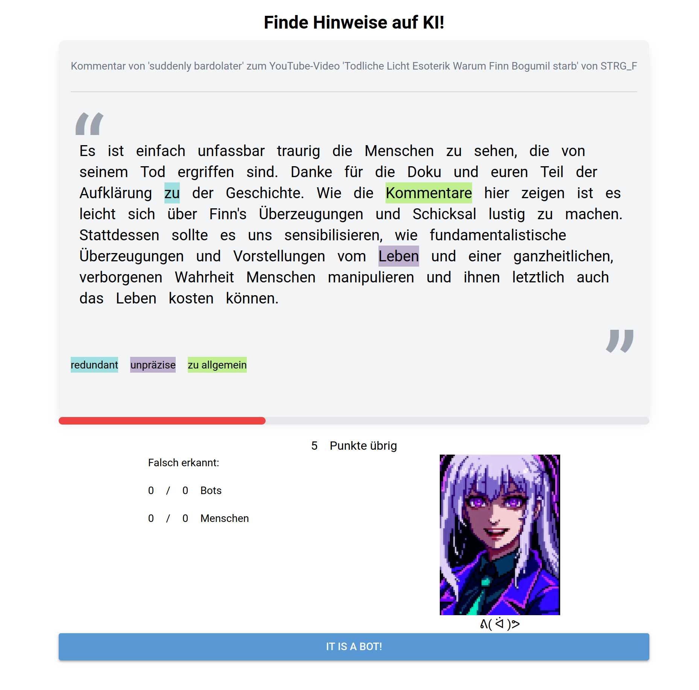

# Spot The Bot - A Community-Agnostic AI Text Recognition Game


Spot The Bot is an innovative web application game designed to enhance the ability of users to distinguish between AI-generated and human-written text. Tailored for various communities, Spot The Bot offers an engaging and educational platform to identify and understand the subtle differences in language usage between humans and AI models.

## Table of Contents
- [About the Project](#about-the-project)
- [Getting Started](#getting-started)
  - [Prerequisites](#prerequisites)
  - [Installation](#installation)
- [Contributing](#contributing)
- [License](#license)
- [Acknowledgments](#acknowledgments)

## About the Project



Spot The Bot allows communities to input their authentic texts and then challenges players to differentiate between these and AI-generated versions of the texts. Players tag suspicious words or phrases with custom labels such as "irrelevant" or "generic," aiding in the identification of AI-generated content and publishing helpful information even for those who prefer not to play the game. The game is designed to be community-agnostic, meaning that it can be tailored to any community, from online forums to social media platforms.

### Features
- **Community Customization:** Tailor the game to any community by inputting authentic, community-specific texts and adapting the style to the community's brand or CI.
- **Interactive Tagging Mechanism:** Engage with content by tagging suspicious words or phrases, learning to discern between AI and human language nuances.
- **Educational Tool:** Enhance critical reading skills and become more discerning of the content consumed online.

### Built With
- [Python](https://www.python.org/)
- [NiceGUI](https://nicegui.io/)
- [Redis](https://www.reddit.com/)
- [FastAPI](https://fastapi.tiangolo.com/)
- [Tailwind CSS](https://tailwindcss.com/)

## Getting Started

To get a local copy up and running, follow these simple steps.

### Prerequisites

List of things you need to use the software and how to install them.
```
example commands
```

### Installation
Starting from [working_directory]

1. Clone the repo
```sh
git clone https://github.com/wehnsdaefflae/SpotTheBot
```

2. Create and activate virtual environment
```sh
cd SpotTheBot
python3 -m venv venv
source venv/bin/activate
```

3. Install pip dependencies
```sh
pip install -r requirements.txt
```
   
4. Configure the database
```sh
nano databases/general.conf
```
```general.conf
bind 127.0.0.1
requirepass [db_password]
port 6379
save 60 10
loglevel verbose
dir databases/
dbfilename spotthebot.rdb
appendonly yes
appendfsync everysec
```

5. Add systemd service file for the database
```sh
sudo nano /etc/systemd/system/spotthebot_db.service
```

```unit
[Unit]
Description=SpotTheBot Redis Server
After=network.target

[Service]
Type=simple
WorkingDirectory=[working_directory]/SpotTheBot
ExecStart=/usr/bin/redis-server [working_directory]/SpotTheBot/databases/general.conf
User=root
Restart=on-failure

[Install]
WantedBy=multi-user.target
```

6. Add a systemd service file for the server
```sh
sudo nano /etc/systemd/system/spotthebot.service
```

```unit
[Unit]
Description=SpotTheBot Python Service
After=network.target

[Service]
Type=simple
User=root
WorkingDirectory=[working_directory]/SpotTheBot
ExecStart=[working_directory]/SpotTheBot/venv/bin/python [working_directory]/SpotTheBot/src/main.py
Environment="PYTHONPATH=[working_directory]/SpotTheBot"

[Install]
WantedBy=multi-user.target
```

7. Install Nginx
```sh
sudo apt install nginx
```

8. Add a Nginx config file (todo: finish this)
```sh
sudo nano /etc/nginx/sites-available/spotthebot
```

```nginx
server {
    listen 80;
    server_name [domain];
    location / {
        proxy_pass http://
```

9. Install https certificates
```sh
sudo certbot --nginx
```

10. Modify the config file
```sh
sudo nano config.json
```

```json
 {
  "nicegui": {
    "host": "0.0.0.0",
    "port": 8000,
    "title": "Spot The Bot!",
    "uvicorn_logging_level": "debug",
    "storage_secret": "[storage secret]",
    "reload": true,
    "tailwind": true,
    "prod_js": false
  },
  "openai": {
    "key": "[openaí_api_key]",
    "parameters": {
      "model": "gpt-4-1106-preview",
      "temperature": 0,
      "top_p": null
    }
  },
  "redis": {
    "users_database": {
      "host": "localhost",
      "port": 6379,
      "password": "[db_password]",
      "db": 0
    },
    "snippets_database": {
      "host": "localhost",
      "port": 6379,
      "password": "[db_password]",
      "db": 1
    },
    "markers_database": {
      "host": "localhost",
      "port": 6379,
      "password": "[db_password]",
      "db": 2
    },
    "invitations_database": {
      "host": "localhost",
      "port": 6379,
      "password": "[db_password]",
      "db": 3
    }
  }
}
```

11Start and enable server and database
```sh
sudo systemctl start spotthebot_db
sudo systemctl enable spotthebot_db
sudo systemctl start spotthebot
sudo systemctl enable spotthebot
 ```

## Contributing

Contributions make the open-source community an amazing place to learn, inspire, and create. Any contributions you make are **greatly appreciated**.

1. Fork the Project
2. Create your Feature Branch (`git checkout -b feature/AmazingFeature`)
3. Commit your Changes (`git commit -m 'Add some AmazingFeature'`)
4. Push to the Branch (`git push origin feature/AmazingFeature`)
5. Open a Pull Request

## License

Distributed under the MIT License. See `LICENSE` for more information.

## Acknowledgments

This project was funded by the German BMBF and the Prototype Fund.


* [BMBF Website](https://www.bmbf.de)
* [Prototype Fund Website](https://prototypefund.de/)

We want to extend our gratitude to all the contributors and funders who made this project possible.
